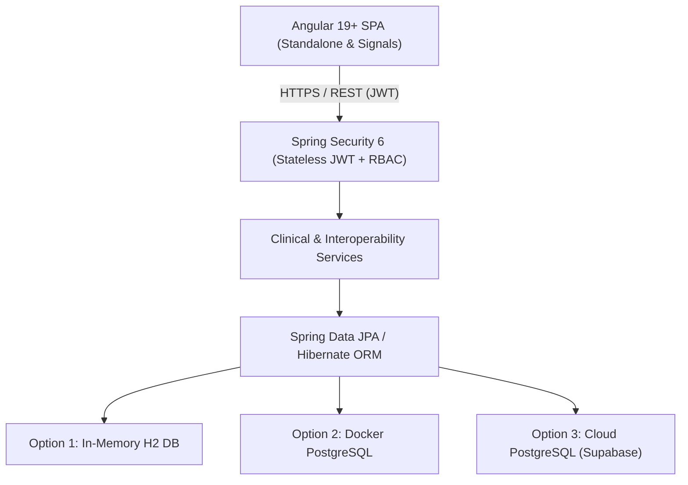

# MedVault Enterprise EHR Platform

> **HL7 FHIR R4 & HIPAA § 164.312 Compliant Electronic Health Record (EHR) & Clinical Management System**

MedVault is an enterprise-scale Electronic Health Record (EHR) platform built with standalone Angular frontend, Spring Boot backend, individual patient data scoping, multi-persona clinical workspaces, real-time Smart Allergy safety engine, HIPAA WORM audit log, and HL7 FHIR R4 interoperability APIs.

---

## 🌟 Key Highlights & Features

- **🌐 Enterprise Landing Page (`/`)**: Overview of clinical features, compliance standards, and direct portal access.
- **🖼️ Split-Screen Sign-In (`/login`)**: Built-in 1-click persona switcher and standard credential sign-in.
- **🔒 HIPAA Scoped Patient Portal**: Logged-in patients (`ROLE_PATIENT`) are strictly scoped to their personal health summary (`/api/patients/user/{userId}`).
- **🩺 Physician Desk (`/dashboard`, `/encounters`, `/diagnoses`)**: SOAP progress notes, ICD-10 & SNOMED-CT problem lists, eRx orders with allergy check overrides.
- **💉 Bedside Nurse Flowsheet (`/vitals`, `/encounters`)**: Longitudinal vitals tracking (BP, HR, Temp, SpO2, Glucose, BMI).
- **⚙️ Admin Command Center (`/admin`, `/patients`)**: Master Patient Index (MPI), user RBAC directory, and 1-click Synthea-aligned synthetic cohort generator.
- **🛡️ HIPAA WORM Compliance Vault (`/audit-ledger`)**: Immutable append-only audit ledger tracking every data action per HIPAA § 164.312(b).
- **⚠️ Smart Allergy Safety Engine**: Real-time RxNorm/SNOMED contraindication cross-checking before prescription issuance.
- **🌐 HL7 FHIR R4 Interoperability API (`/fhir/v1/*`)**: JSON endpoints exporting standard FHIR resources (`Patient`, `Encounter`, `AllergyIntolerance`, `Condition`, `MedicationRequest`, `Observation`).

---

## 🔑 Pre-Configured Demo Credentials

| Role | Username | Password | User Profile | Primary Scope |
| :--- | :--- | :--- | :--- | :--- |
| **Patient 1** | `user_kamran` | `patient123` | **Kamran Khan** (`PAT-1001`) | Personal Health Summary, Type 2 Diabetes, Penicillin Allergy |
| **Patient 2** | `user_aarav` | `patient123` | **Aarav Patel** (`PAT-1002`) | Personal Health Summary, Essential Hypertension |
| **Patient 3** | `user_ananya` | `patient123` | **Ananya Sharma** (`PAT-1003`) | Personal Health Summary, Latex Allergy |
| **Doctor (Cardiology)**| `doctor_mahtab` | `doctor123` | **Dr. Mahtab Khan** | Physician Desk, SOAP Notes, eRx Safety Overrides |
| **Doctor (Neurology)**| `doctor_rajesh` | `doctor123` | **Dr. Rajesh Sharma** | Physician Desk, Neurology Consultations |
| **Clinical Nurse** | `nurse_priya` | `nurse123` | **Nurse Priya Verma** | Bedside Vitals Flowsheet, Encounter Logs |
| **Hospital Admin** | `admin` | `admin123` | **Dr. Vikramaditya Gupta** | MPI Registration, RBAC, Synthetic Cohort Generator |
| **Compliance Auditor**| `auditor` | `auditor123` | **Inspector Suresh Menon** | Read-Only WORM Audit Vault |

---

## 🏗️ Technology Stack

- **Frontend**: Angular 19+ (Standalone Components, Signals, Reactive Forms, Vanilla CSS system).
- **Backend**: Java 17 / Spring Boot 3.2+, Spring Security 6 (Stateless JWT Authentication & `@PreAuthorize` Method Security).
- **Database & Data**: Relational JPA/Hibernate. Database table creation and seed data provided via standard SQL scripts (`schema.sql`, `seed.sql`).
- **Containerization**: Docker Compose service for `medvault-postgres-db`.

---

## 🏛️ System Architecture

For a complete architectural specification, security sequence flows, and database decoupling diagrams, see **[architecture.md](file:///mnt/workspace/MedVault/architecture.md)**.



---

## 🚀 Quick Start

### 1. Database Execution & Running Options

MedVault supports 3 execution environments without application code changes:

#### Option 1: Standalone In-Memory H2 (Zero Setup - No Docker Required)
Default fallback mode for instant local testing and development.
```bash
cd backend
./mvnw spring-boot:run
```
*Spring Boot uses an embedded in-memory database (`jdbc:h2:mem:medvaultdb`) with H2 PostgreSQL mode. Tables and seed data auto-initialize on startup.*

* **Interactive H2 Web Console**: Access at `http://localhost:8080/h2-console`
  - **JDBC URL**: `jdbc:h2:mem:medvaultdb`
  - **User Name**: `sa`
  - **Password**: *(leave blank)*

#### Option 2: Local PostgreSQL Container (Docker Compose)
1. Start the PostgreSQL 16 container (auto-loads `schema.sql` and `seed.sql` on first boot):
   ```bash
   docker compose up -d
   ```
2. Start the backend connected to the local container:
   ```bash
   cd backend
   SPRING_DATASOURCE_URL=jdbc:postgresql://localhost:5432/medvault \
   SPRING_DATASOURCE_DRIVER=org.postgresql.Driver \
   SPRING_DATASOURCE_USERNAME=medvault \
   SPRING_DATASOURCE_PASSWORD=MedVaultPass123! \
   SPRING_JPA_DATABASE_PLATFORM=org.hibernate.dialect.PostgreSQLDialect \
   ./mvnw spring-boot:run
   ```

#### Option 3: Cloud PostgreSQL (Supabase / AWS RDS / GCP Cloud SQL)
Set terminal environment variables with your cloud connection string and credentials:
```bash
export SPRING_DATASOURCE_URL="jdbc:postgresql://db.<your-project-ref>.supabase.co:5432/postgres?sslmode=require"
export SPRING_DATASOURCE_DRIVER="org.postgresql.Driver"
export SPRING_DATASOURCE_USERNAME="postgres"
export SPRING_DATASOURCE_PASSWORD="YourSupabasePassword123!"
export SPRING_JPA_DATABASE_PLATFORM="org.hibernate.dialect.PostgreSQLDialect"

cd backend
./mvnw spring-boot:run
```

#### Option 4: Manual DDL/DML Script Execution (Docker CLI or SQL Editors)
- **Docker CLI**:
  ```bash
  docker exec -i medvault-postgres-db psql -U medvault -d medvault < backend/src/main/resources/schema.sql
  docker exec -i medvault-postgres-db psql -U medvault -d medvault < backend/src/main/resources/seed.sql
  ```
- **GUI SQL Editor (DBeaver / pgAdmin / TablePlus / Supabase SQL Editor)**:
  - Connect to host `localhost:5432` (`medvault`) or Supabase URL.
  - Run `backend/src/main/resources/schema.sql` followed by `backend/src/main/resources/seed.sql`.

### 2. Backend Server
```bash
cd backend
./mvnw spring-boot:run
```
*API runs at `http://localhost:8080`*

### 3. Frontend Web App
```bash
cd frontend
npm install
npm start
```
*App runs at `http://localhost:4200`*

---

## 🧪 Build & Verification Commands

```bash
# Backend Build & Test
cd backend
./mvnw compile
./mvnw test

# Frontend Production Build
cd frontend
npm run build
```

---

## 📁 Repository Directory Structure

```
MedVault/
├── backend/                  # Spring Boot REST API & Security Engine
│   ├── src/                  # Source code & SQL scripts (src/main/resources/{schema.sql,seed.sql})
│   └── pom.xml
│
├── frontend/                 # Angular Standalone Enterprise UI
│   ├── src/                  # Components, Services, Guards, Routes
│   └── package.json
│
├── docker-compose.yml        # Docker setup for database container (medvault-postgres-db)
└── README.md                 # Master Project Overview
```
