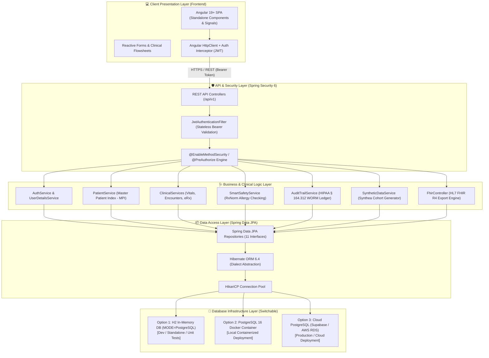
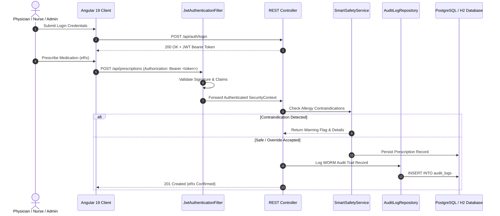
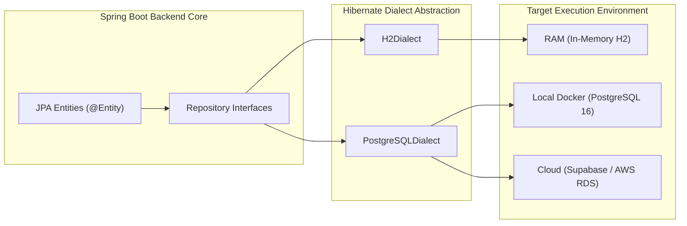

# MedVault EHR Platform - Architecture & System Design Document

This document provides a comprehensive technical breakdown of the architecture, security patterns, data flows, and database infrastructure of the **MedVault** Electronic Health Record (EHR) system.

---

## 🏛️ High-Level System Architecture



---

## 🛡️ Security & Authentication Flow Architecture

MedVault implements stateless, token-based authentication compliant with HIPAA administrative and technical safeguards (§ 164.312).



---

## 🔑 Role-Based Access Control (RBAC) Matrix

MedVault enforces fine-grained method-level security using Spring Security `@PreAuthorize`:

| Endpoint Group | Role Required | Operations Permitted |
| :--- | :--- | :--- |
| `/api/auth/**` | Public / Anonymous | Login, Registration |
| `/api/patients/**` | `ROLE_ADMIN`, `ROLE_DOCTOR`, `ROLE_NURSE`, `ROLE_AUDITOR` | View Master Patient Index (MPI), Search Patients |
| `/api/patients` | `ROLE_ADMIN` | Create Patient Profile |
| `/api/patients/user/{id}` | `ROLE_PATIENT` | Self-Service Patient Portal View |
| `/api/encounters/**` | `ROLE_DOCTOR`, `ROLE_NURSE`, `ROLE_ADMIN` | View Visit Summaries & Record SOAP Notes |
| `/api/prescriptions/**` | `ROLE_DOCTOR` | Run Allergy Safety Checks & Submit eRx Orders |
| `/api/vitals/**` | `ROLE_DOCTOR`, `ROLE_NURSE` | Record & Track Longitudinal Patient Vitals |
| `/api/admin/audit-logs` | `ROLE_ADMIN`, `ROLE_AUDITOR` | Inspect Immutable HIPAA Audit Ledger |
| `/fhir/v1/**` | `ROLE_ADMIN`, `ROLE_DOCTOR`, `ROLE_AUDITOR` | Export HL7 FHIR R4 Bundles |

---

## 💾 Database Infrastructure Flexibility & Decoupling

MedVault decouples business code from underlying storage engines using **Spring Data JPA** and **Hibernate ORM**. The database infrastructure can be swapped without modifying backend source code:



### Environment Switching Mechanism

Database selection is governed dynamically by environment variables configured in `backend/src/main/resources/application.properties`:

| Target Environment | `SPRING_DATASOURCE_URL` | `SPRING_JPA_DATABASE_PLATFORM` | Execution Trigger |
| :--- | :--- | :--- | :--- |
| **Standalone H2 (RAM)** | `jdbc:h2:mem:medvaultdb;MODE=PostgreSQL` | `org.hibernate.dialect.H2Dialect` | `./mvnw spring-boot:run` (Default) |
| **Docker PostgreSQL** | `jdbc:postgresql://localhost:5432/medvault` | `org.hibernate.dialect.PostgreSQLDialect` | `docker compose up -d` |
| **Cloud PostgreSQL** | `jdbc:postgresql://db.<ref>.supabase.co:5432/postgres?sslmode=require` | `org.hibernate.dialect.PostgreSQLDialect` | System Environment Variables |

---

## 🌐 HL7 FHIR R4 Enterprise Interoperability Subsystem

MedVault features a built-in, gold-standard **HL7 FHIR Release 4 (v4.0.1)** engine (`FhirService` & `FhirController`) exposing full RESTful CRUD interactions, discovery metadata, and clinical bundles:

* **FHIR Conformance Statement** (`GET /fhir/v1/metadata`): Returns official FHIR R4 `CapabilityStatement` declaring server software capabilities, supported resources, search parameters, and OAuth2/Bearer JWT security definitions.
* **FHIR Patient** (`/fhir/v1/Patient`): Complete `HumanName` structures, MRN (`urn:oid:2.16.840.1.113883.4.1`) & SSN identifiers, telecom, address, gender, birth date, and insurance extension. Supports `GET`, `POST`, `PUT`, `DELETE`, and single read `GET /Patient/{id}`.
* **FHIR Encounter** (`/fhir/v1/Encounter`): Visit classification (`AMB`/`IMP`/`EMER`), chief complaint, participant practitioners, and start/end period.
* **FHIR AllergyIntolerance** (`/fhir/v1/AllergyIntolerance`): Clinical/verification status codes, category, criticality, and RxNorm substance codings (`http://www.nlm.nih.gov/research/umls/rxnorm`).
* **FHIR Condition** (`/fhir/v1/Condition`): Problem list items with dual **ICD-10** (`http://hl7.org/fhir/sid/icd-10`) & **SNOMED CT** (`http://snomed.info/sct`) codings.
* **FHIR MedicationRequest** (`/fhir/v1/MedicationRequest`): Active eRx orders with RxNorm codings, requester practitioner, intent (`order`), and dosage instructions.
* **FHIR Observation** (`/fhir/v1/Observation`): Vital signs flowsheet with standard **LOINC** codes (`http://loinc.org`) and **UCUM** units (`mmHg`, `/min`, `Cel`, `%`, `kg/m2`, `mg/dL`):
  - Blood Pressure Panel (`85354-9`) with Systolic (`8480-6`) & Diastolic (`8462-4`) components
  - Heart Rate (`8867-4`), Body Temperature (`8310-5`), SpO2 (`2708-6`), Respiratory Rate (`9279-1`)
  - Weight (`29463-7`), Height (`8302-2`), BMI (`39156-5`), Blood Glucose (`15074-8`).
* **Patient `$everything` Operation** (`GET /fhir/v1/Patient/{id}/$everything`): Exports longitudinal patient clinical history into a single FHIR `Bundle`.
* **Standard Error Handling**: Formatted `OperationOutcome` payloads returned for 404, 400, 403, and 500 statuses.
* **Interactive FHIR Explorer**: Standalone Angular dashboard (`/fhir-explorer`) for live querying, metadata inspection, and payload ingestion.

---

## 📁 Repository Architectural Map

```
MedVault/
├── architecture.md           # Architecture & System Design Specification (This Document)
├── README.md                 # Master Quick Start & Execution Guide
├── docker-compose.yml        # PostgreSQL Container Orchestration
│
├── backend/                  # Spring Boot 3.2 REST API & Security Engine
│   ├── src/main/java/com/medvault/
│   │   ├── config/           # SecurityConfig, CorsConfig
│   │   ├── controller/       # AuthController, PatientController, FhirController, etc.
│   │   ├── dto/              # Request/Response Data Transfer Objects & JWT Auth DTOs
│   │   ├── model/            # JPA Domain Entities (User, Patient, Encounter, Vital, etc.)
│   │   ├── repository/       # 11 Spring Data JPA Repositories
│   │   ├── security/         # JwtTokenProvider, JwtAuthenticationFilter, CustomUserDetails
│   │   └── service/          # SmartSafetyService, SyntheticDataService, AuditTrailService
│   │
│   └── src/main/resources/
│       ├── schema.sql        # Database DDL Script
│       ├── seed.sql          # Sample Data DML Script
│       └── application.properties
│
└── frontend/                 # Angular 19 Enterprise Web Application
    └── src/app/
        ├── components/       # Standalone UI Components (Patients, eRx, Vitals, Audit)
        ├── guards/           # Angular AuthGuard & RoleGuard
        ├── interceptors/     # JwtInterceptor (Bearer Token Injection)
        └── services/         # ApiService, AuthService, PatientService
```
