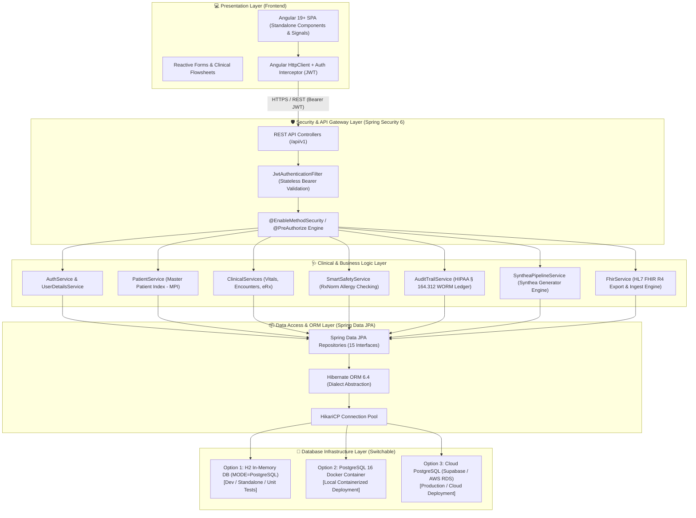
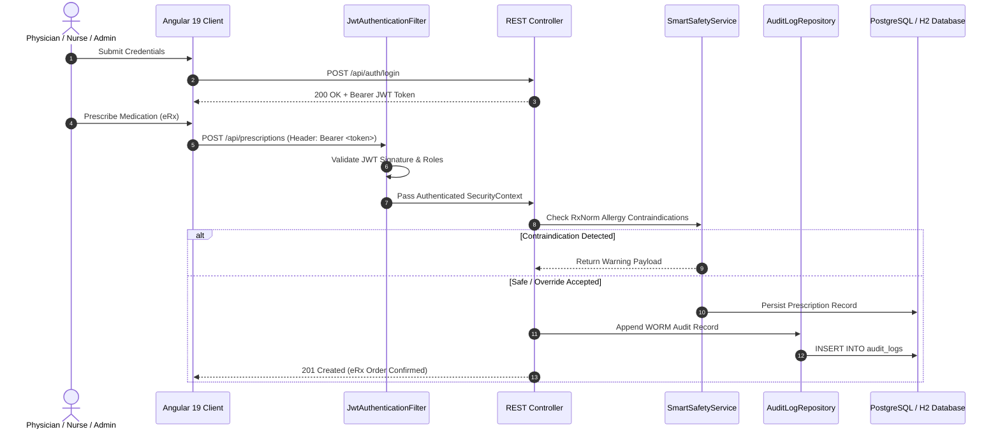
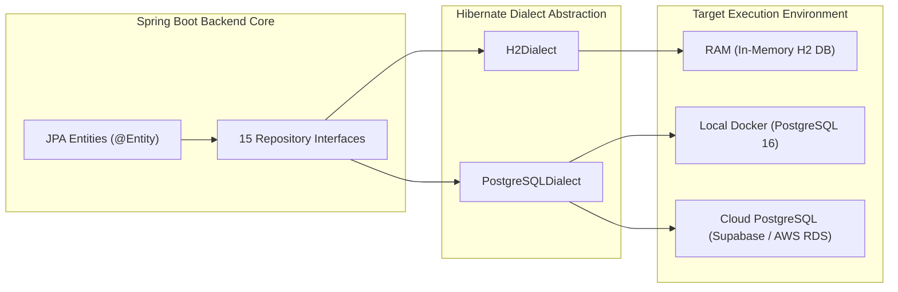

# MedVault EHR Platform - Architecture & System Design Specification

This document provides a senior-engineer-level technical breakdown of the architecture, security patterns, data flows, and database infrastructure of the **MedVault** Electronic Health Record (EHR) platform.

---

## 🏛️ High-Level System Architecture

MedVault is designed as an enterprise-scale, decoupled, multi-tier healthcare application. It isolates the presentation layer, API security, domain business services, persistence abstraction, and underlying storage targets.

---

## 💡 Real-World Architectural Analogies

To make MedVault's design intuitive across clinical and engineering teams, consider these core component analogies:

| MedVault Component | Real-World Analogy | Technical Function |
| :--- | :--- | :--- |
| **Spring Security & JWT Filter** | **Hospital Badge Scanner & Security Gate** | Intercepts every incoming HTTPS request, validates the cryptographic token signature, and checks the user's role before granting access to patient records. |
| **Smart Allergy Safety Engine** | **Pharmacist Double-Check Alert** | Automatically cross-references new prescription orders against documented patient allergies and flags potential contraindications before an eRx order is finalized. |
| **HIPAA WORM Audit Ledger** | **Black Box Flight Recorder** | An immutable, append-only vault that logs every data action (who, what, when, IP address) for regulatory compliance under HIPAA § 164.312(b). |
| **Synthea Generator Pipeline** | **Medical Holodeck** | Runs the official Synthea Java framework to simulate realistic patient lifetimes (demographics, chronic conditions, vitals, prescriptions) and outputs HL7 FHIR R4 bundles. |
| **HL7 FHIR R4 Interoperability Subsystem** | **Universal Translator** | Converts internal MedVault database entities into standard FHIR R4 JSON resources (`Patient`, `Encounter`, `Observation`, etc.) for seamless exchange with external EHRs. |

---

## 🛡️ Security & Authentication Architecture

MedVault implements stateless JWT bearer authentication compliant with HIPAA administrative and technical safeguards (§ 164.312).

---

## 💾 Database Infrastructure Flexibility & Decoupling

MedVault decouples business code from underlying storage engines using **Spring Data JPA** and **Hibernate ORM**. The database infrastructure can be swapped without modifying backend source code:

---

## 🔐 Role-Based Access Control (RBAC) Matrix

MedVault enforces fine-grained method-level security using Spring Security `@PreAuthorize`:

| Endpoint Group | Allowed Roles | Access Scope & Authorization |
| :--- | :--- | :--- |
| `/api/auth/**` | Public / Anonymous | Sign in, public patient self-registration (`ROLE_PATIENT` only) |
| `/api/patients/**` | `ROLE_ADMIN`, `ROLE_DOCTOR`, `ROLE_NURSE`, `ROLE_AUDITOR` | View Master Patient Index (MPI), search patient directory |
| `/api/patients` | `ROLE_ADMIN` | Register new patient profile in MPI |
| `/api/patients/user/{id}` | `ROLE_PATIENT` | Self-service view strictly scoped to logged-in patient's record |
| `/api/encounters/**` | `ROLE_DOCTOR`, `ROLE_NURSE`, `ROLE_ADMIN` | View visit summaries, record SOAP progress notes |
| `/api/prescriptions/**` | `ROLE_DOCTOR` | Run allergy safety checks, issue eRx orders with overrides |
| `/api/vitals/**` | `ROLE_DOCTOR`, `ROLE_NURSE` | Record and track longitudinal patient vitals flowsheets |
| `/api/admin/audit-logs` | `ROLE_ADMIN`, `ROLE_AUDITOR` | Inspect immutable HIPAA forensic audit ledger |
| `/api/synthetic/**` | `ROLE_ADMIN`, `ROLE_DOCTOR` | Execute Synthea generator pipeline, ingest FHIR bundles |
| `/fhir/v1/**` | `ROLE_ADMIN`, `ROLE_DOCTOR`, `ROLE_AUDITOR` | Read/write standard HL7 FHIR R4 clinical resources & bundles |
