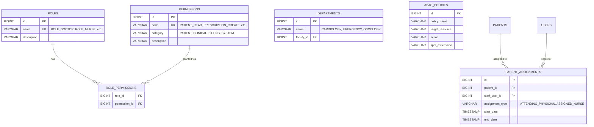

# MedVault EHR Role-Based & Attribute-Based Access Control (RBAC + ABAC) Specification

This document defines the production-grade **Role-Based Access Control (RBAC)** and **Attribute-Based Access Control (ABAC)** matrix and security architecture for the **MedVault EHR Platform**.

---

## 🎯 Architectural Overview

In a modern enterprise Electronic Health Record (EHR) system, access control cannot rely solely on simple top-level roles (e.g., `Doctor = full access`). MedVault implements a **Hybrid RBAC + ABAC Security Model**:

1. **Role-Based Access Control (RBAC)**: Defines **what coarse-grained actions** a role is generally authorized to perform (e.g., `Doctor` can `CREATE_PRESCRIPTION`, `Nurse` can `RECORD_VITALS`).
2. **Attribute-Based Access Control (ABAC)**: Evaluates **runtime contextual attributes** (e.g., treatment relationship, care team assignment, department match, facility location, time of access, and Purpose of Use) before granting access to a specific patient's Protected Health Information (PHI).

---

## 👥 The 10 Baseline System Roles

MedVault categorizes operations across **10 production roles**:

1. **System Administrator (`ROLE_SYS_ADMIN`)**: Platform-level infrastructure, tenant provisioning, system configurations, and cross-site audit monitoring. No direct clinical record edit access.
2. **Organization / Clinic Administrator (`ROLE_ORG_ADMIN`)**: Hospital or clinic facility administrator. Manages clinic users, provider schedules, facility departments, and billing configurations.
3. **Doctor / Physician (`ROLE_DOCTOR`)**: Attending/consulting physician. Full clinical authority over diagnosis, clinical notes, order entry (eRx, labs), care plans, and medical history.
4. **Nurse (`ROLE_NURSE`)**: Registered nurse or clinical care provider. Responsible for patient triage, vitals flowsheets, nursing progress notes, medication administration, and care plan updates.
5. **Receptionist (`ROLE_RECEPTIONIST`)**: Patient intake and front-desk coordinator. Manages demographics, check-in, appointment scheduling, insurance verification, and basic invoicing.
6. **Lab Technician (`ROLE_LAB_TECH`)**: Laboratory specialist. Processes diagnostic specimens, enters lab test results, manages lab equipment orders, and uploads clinical diagnostic documents.
7. **Pharmacist (`ROLE_PHARMACIST`)**: Clinical pharmacist. Reviews eRx orders, performs drug-allergy & drug-drug reconciliation, dispenses medications, and logs administration history.
8. **Billing Officer (`ROLE_BILLING`)**: Financial and revenue cycle specialist. Creates invoices, processes insurance claims, records patient payments, and generates financial compliance reports.
9. **Patient (`ROLE_PATIENT`)**: Individual health recipient. Accesses self-service portal to view personal medical history, vitals, lab reports, eRx history, and manage appointments/consent.
10. **Auditor / Compliance Officer (`ROLE_AUDITOR`)**: Independent HIPAA compliance auditor. Read-only inspection access to immutable WORM audit logs, security reports, and access logs.

---

## 1. Permission Legend

| Symbol | Meaning | Description |
| :--- | :--- | :--- |
| **C** | Create | Permission to create new records (e.g., issue new prescription). |
| **R** | Read | Permission to view or retrieve record details. |
| **U** | Update | Permission to modify existing non-locked record fields. |
| **D** | Delete | Hard deletion (generally restricted in EHRs; soft-deletion or amendment preferred). |
| **CRU** | Create + Read + Update | Standard workflow authority without permanent hard delete privileges. |
| **CRUD** | Full CRUD | Complete CRUD privileges (reserved for non-clinical setup metadata). |
| **—** | No Access | Explicitly forbidden / blocked. |
| **L** | Limited Access | Access restricted to specific fields, departmental bounds, or self-service boundaries. |
| **A** | Approve / Authorize | Special authority to verify, countersign, or authorize pending actions. |

> [!IMPORTANT]
> **HIPAA § 164.312 Data Integrity Safeguard**: Hard deletion (`D`) is strictly forbidden for patient medical records. Clinical corrections must use immutable amendment tracking, versioning, or addendums.

---

## 2. Patient & Demographic Matrix

| Resource / Action | Sys Admin | Org Admin | Doctor | Nurse | Receptionist | Lab Tech | Pharmacist | Billing | Patient | Auditor |
| :--- | :---: | :---: | :---: | :---: | :---: | :---: | :---: | :---: | :---: | :---: |
| Create Patient | — | CRU | C | C | **CRU** | — | — | — | — | — |
| View Demographics | — | R | R | R | **R** | R | R | R | **R** | R |
| Update Demographics | — | U | L | L | **U** | — | — | L | U* | — |
| Delete Patient | — | — | — | — | — | — | — | — | — | — |
| Patient Identifier (MRN/SSN) | — | R | R | R | R | R | R | R | R | R |
| Emergency Contact | — | R | R | R | R | L | L | L | U | R |
| Insurance Information | — | R | R | R | **CRU** | — | — | **CRU** | R | R |
| Patient Consent Directives | — | R | R | R | CRU | R | R | R | **CRU** | R |

`*` *Patient self-service update is strictly restricted to selected profile fields (phone, email, address, emergency contact), excluding clinical identity markers (MRN, SSN).*

---

## 3. Appointment Matrix

| Action | Sys Admin | Org Admin | Doctor | Nurse | Receptionist | Lab Tech | Pharmacist | Billing | Patient | Auditor |
| :--- | :---: | :---: | :---: | :---: | :---: | :---: | :---: | :---: | :---: | :---: |
| Create Appointment | — | CRU | CRU | C | **CRU** | — | — | — | C | — |
| View Appointment | — | R | R | R | R | R | R | R | R | R |
| Reschedule | — | U | U | L | **U** | — | — | — | U | — |
| Cancel Appointment | — | U | U | L | **U** | — | — | — | U | — |
| Assign Provider | — | **U** | — | — | **U** | — | — | — | — | — |
| View Visit History | — | R | R | R | R | L | L | R | R | R |

---

## 4. Clinical Record Matrix

The Clinical Record Matrix governs direct access to Protected Health Information (PHI).

| Clinical Resource | Sys Admin | Org Admin | Doctor | Nurse | Receptionist | Lab Tech | Pharmacist | Billing | Patient | Auditor |
| :--- | :---: | :---: | :---: | :---: | :---: | :---: | :---: | :---: | :---: | :---: |
| Medical History | — | L | **CRU** | R | — | L | L | — | R | R |
| Documented Allergies | — | L | **CRU** | R/U | — | L | R | — | R/U | R |
| Active Diagnoses | — | — | **CRU** | R | — | L | R | — | R | R |
| Physician Notes (SOAP) | — | — | **CRU** | CRU | — | — | — | — | R | R |
| Nursing Notes | — | — | R | **CRU** | — | — | — | — | R | R |
| Problem List | — | L | **CRU** | R/U | — | L | R | — | R | R |
| Vital Signs | — | — | R/U | **CRU** | — | — | — | — | R | R |
| Care Plans | — | — | **CRU** | CRU | — | — | — | — | R | R |
| Clinical Documents | — | L | **CRU** | CRU | L | CRU | R | — | R | R |
| Discharge Summaries | — | — | **CRU** | R | — | — | R | R | R | R |

> [!NOTE]
> **Least Privilege Enforced**: Receptionists and administrative staff cannot access SOAP notes, diagnoses, nursing charts, or vital signs, even though they manage front-desk registration for the same patient.

---

## 5. Vital Signs Matrix

| Action | Doctor | Nurse | Receptionist | Lab Tech | Pharmacist | Patient | Auditor |
| :--- | :---: | :---: | :---: | :---: | :---: | :---: | :---: |
| Record Vitals | **C** | **C** | — | — | — | L | — |
| View Vitals Flowsheet | R | **R** | — | L | L | R | R |
| Modify Vitals | U | U | — | — | — | — | — |
| Delete Vitals | — | — | — | — | — | — | — |
| Amend Erroneous Vitals | **U/Amend** | **U/Amend** | — | — | — | — | — |

*Amending vital signs generates an append-only audit trail capturing the old value, new value, reason for correction, author, and timestamp.*

---

## 6. Medication Matrix

| Action | Doctor | Nurse | Pharmacist | Receptionist | Patient | Auditor |
| :--- | :---: | :---: | :---: | :---: | :---: | :---: |
| View Medication History | R | R | **R** | — | R | R |
| Create Prescription (eRx) | **C** | — | — | — | — | R |
| Modify Prescription | **U** | — | L | — | — | R |
| Cancel Prescription | **U** | — | L/A | — | — | R |
| Dispense Medication | — | — | **CRU** | — | — | R |
| Record Administration (MAR) | — | **C** | L | — | — | R |
| Medication Reconciliation | **CRU** | **CRU** | **CRU** | — | L | R |

---

## 7. Laboratory Matrix

| Action | Doctor | Nurse | Lab Tech | Receptionist | Pharmacist | Patient | Auditor |
| :--- | :---: | :---: | :---: | :---: | :---: | :---: | :---: |
| Order Lab Test | **C** | L | — | — | — | — | R |
| View Lab Order | R | R | **R** | L | L | R | R |
| Collect Specimen | — | **C** | **C** | — | — | — | R |
| Process Specimen | — | — | **CRU** | — | — | — | R |
| Enter Result | — | L | **C/U** | — | — | — | R |
| Verify Result | **A** | L | A* | — | — | — | R |
| View Result | **R** | **R** | R | — | R | R | R |
| Amend Result | — | — | **U/Amend** | — | — | — | R |

`*` *Pathologist / Senior Lab Technician verification.*

---

## 8. Billing & Financial Matrix

| Action | Org Admin | Doctor | Nurse | Receptionist | Billing Officer | Patient | Auditor |
| :--- | :---: | :---: | :---: | :---: | :---: | :---: | :---: |
| Create Invoice | R/A | — | — | C | **C** | — | R |
| View Invoice | R | L | — | R | **R** | R | R |
| Update Invoice | U | — | — | L | **U** | — | R |
| Record Payment | R | — | — | L | **C/U** | — | R |
| Process Refund | A | — | — | — | C | — | R |
| Insurance Claim | R | L | — | L | **CRU** | R | R |
| Financial Reports | **R** | — | — | L | **R** | — | R |

---

## 9. User & Organization Administration Matrix

| Action | System Admin | Org Admin | Doctor | Nurse | Receptionist |
| :--- | :---: | :---: | :---: | :---: | :---: |
| Create User Account | **C** | **C** | — | — | — |
| Disable/Deactivate User | **U** | **U** | — | — | — |
| Reset User Credentials | **A** | **A** | — | — | — |
| Assign Role | **A** | **A/L** | — | — | — |
| Manage Permissions | **A** | L | — | — | — |
| Create Department | **CRU** | **CRU** | — | — | — |
| Manage Clinic Facilities | **CRU** | **CRU** | — | — | — |
| Platform System Configuration | **CRU** | L | — | — | — |
| Org Facility Configuration | **CRU** | **CRU** | — | — | — |

---

## 10. Audit & Security Matrix

| Action | Sys Admin | Org Admin | Doctor | Nurse | Receptionist | Lab Tech | Pharmacist | Billing | Patient | Auditor |
| :--- | :---: | :---: | :---: | :---: | :---: | :---: | :---: | :---: | :---: | :---: |
| View Audit Logs | **R** | R | L | L | — | L | L | L | L | **R** |
| Create Audit Log | System | System | System | System | System | System | System | System | System | System |
| Modify Audit Log | **—** | — | — | — | — | — | — | — | — | — |
| Delete Audit Log | **—** | — | — | — | — | — | — | — | — | — |
| Security Reports | **R** | R | — | — | — | — | — | — | — | **R** |
| Access History | **R** | R | R | R | R | R | R | R | **R** | **R** |

```text
                               WORM AUDIT PIPELINE
                               ┌─────────────────┐
                               │  System Event   │
                               └────────┬────────┘
                                        │
                                 INSERT INTO DB
                                        │
                               ┌────────▼────────┐
                               │   Audit Log     │
                               └────────┬────────┘
                    ┌───────────────────┴───────────────────┐
                    │                                       │
            READ Authorized Roles                    UPDATE / DELETE
                (Admin/Auditor)                        (BLOCKED FOR ALL)
```

---

## 11. Patient Portal Matrix

| Resource / Action | Patient Access Scope |
| :--- | :---: |
| Own Demographics | CRU |
| Own Appointments | CRU |
| Own Medical History | R |
| Own Diagnoses | R |
| Own Documented Allergies | R/U |
| Own Prescriptions | R |
| Own Lab Reports | R |
| Own Clinical Documents | R |
| Own Invoices & Billing | R |
| Own Payments | R |
| Own Consent Directives | CRU |
| Other Patient's Data | **— (BLOCKED)** |
| Staff Internal Records | **— (BLOCKED)** |
| Personal Audit Access Logs | L (Own access log only) |
| System Administration | **— (BLOCKED)** |

---

## 12. Granular Role & Permission Architecture

Rather than hardcoding role checks in code, MedVault uses a decoupled **Role ↔ Permission** mapping architecture.

### Database ER Schema for Security



### Role to Permission Mapping Examples

```text
NURSE
 ├── PATIENT_READ
 ├── MEDICAL_HISTORY_READ
 ├── ALLERGY_READ
 ├── ALLERGY_UPDATE
 ├── VITALS_CREATE
 ├── VITALS_READ
 ├── VITALS_UPDATE
 ├── NURSING_NOTE_CREATE
 ├── NURSING_NOTE_READ
 ├── NURSING_NOTE_UPDATE
 ├── PRESCRIPTION_READ
 ├── MEDICATION_ADMINISTER
 ├── LAB_ORDER_READ
 └── LAB_RESULT_READ

DOCTOR
 ├── PATIENT_READ
 ├── PATIENT_UPDATE
 ├── MEDICAL_HISTORY_CREATE
 ├── MEDICAL_HISTORY_READ
 ├── MEDICAL_HISTORY_UPDATE
 ├── DIAGNOSIS_CREATE
 ├── DIAGNOSIS_READ
 ├── DIAGNOSIS_UPDATE
 ├── CLINICAL_NOTE_CREATE
 ├── CLINICAL_NOTE_READ
 ├── CLINICAL_NOTE_UPDATE
 ├── VITALS_CREATE
 ├── VITALS_READ
 ├── VITALS_UPDATE
 ├── PRESCRIPTION_CREATE
 ├── PRESCRIPTION_READ
 ├── PRESCRIPTION_UPDATE
 ├── LAB_ORDER_CREATE
 ├── LAB_ORDER_READ
 └── LAB_RESULT_READ
```

---

## 13. Contextual ABAC Architecture

RBAC alone establishes *capability*, but **ABAC establishes *permission in context***.

```text
                    ┌───────────────────────────────┐
                    │    Incoming API Request       │
                    │ GET /api/patients/1001/vitals │
                    └───────────────┬───────────────┘
                                    │
                                    ▼
                    ┌───────────────────────────────┐
                    │  Layer 1: RBAC Permission     │
                    │  User has VITALS_READ?        │
                    └───────────────┬───────────────┘
                                    │ YES
                                    ▼
                    ┌───────────────────────────────┐
                    │  Layer 2: ABAC Policy Engine  │
                    │  - Patient in User's Dept?    │
                    │  - Treatment relationship?    │
                    │  - Emergency Break-Glass?     │
                    │  - Purpose of Use == TREATMENT│
                    └───────────────┬───────────────┘
                                    │
                     ┌──────────────┴──────────────┐
                     │                             │
                     ▼                             ▼
              [ ALLOW ACCESS ]              [ DENY ACCESS ]
             Log Audit Activity           Log Security Violation
```

### Real-World Evaluation Scenario

**Scenario**: Doctor A (Cardiology) attempts to view Patient #1001 (Oncology).

1. **RBAC Evaluation**: `Doctor A` has `ROLE_DOCTOR` $\rightarrow$ grants `VITALS_READ`. **Result: PASS**.
2. **ABAC Evaluation**:
   - `user.department == patient.department` $\rightarrow$ `Cardiology != Oncology` (**FAIL**).
   - `patient.assignedDoctors` contains `Doctor A` $\rightarrow$ **FALSE**.
   - `request.header.breakGlass` $\rightarrow$ `false`.
3. **Final Decision**: **DENY ACCESS (403 Forbidden)**.

---

## 14. Technical Stack Implementation Mapping

### Spring Boot 3 / Java Backend Implementation

In Spring Boot, method security combines RBAC and custom ABAC expression handlers:

```java
@RestController
@RequestMapping("/api/v1/patients")
@RequiredArgsConstructor
public class PatientClinicalController {

    private final PatientService patientService;

    // Layer 1 (RBAC) + Layer 2 (ABAC) combined via custom SpEL evaluator
    @GetMapping("/{patientId}/clinical-notes")
    @PreAuthorize("hasAuthority('CLINICAL_NOTE_READ') and @abacSecurityEvaluator.hasTreatmentRelationship(authentication, #patientId)")
    public ResponseEntity<List<ClinicalNoteDto>> getClinicalNotes(@PathVariable Long patientId) {
        return ResponseEntity.ok(patientService.getClinicalNotes(patientId));
    }

    // Emergency Break-Glass override for physicians
    @PostMapping("/{patientId}/break-glass")
    @PreAuthorize("hasRole('DOCTOR')")
    public ResponseEntity<Void> emergencyBreakGlass(
            @PathVariable Long patientId,
            @RequestBody BreakGlassRequest request) {
        patientService.executeEmergencyBreakGlass(patientId, request.getReason());
        return ResponseEntity.ok().build();
    }
}
```

### Angular 19 Frontend Route & UI Guards

In the Angular frontend, functional guards and directives hide unauthorized elements and block navigation:

```typescript
// RBAC + ABAC Functional Route Guard
export const clinicalAccessGuard: CanActivateFn = (route, state) => {
  const authService = inject(AuthService);
  const router = inject(Router);
  const patientId = route.paramMap.get('id');

  const hasPermission = authService.hasPermission('CLINICAL_NOTE_READ');
  const hasRelationship = authService.hasActivePatientRelationship(patientId);

  if (hasPermission && hasRelationship) {
    return true;
  }

  router.navigate(['/unauthorized']);
  return false;
};
```

---

## 🔐 Summary Checklist for HIPAA Compliance

- [x] **Least Privilege**: Administrative staff blocked from viewing clinical SOAP notes.
- [x] **Immutability**: Medical records and audit logs allow `C`, `R`, `U (Amend)`, but never `D (Hard Delete)`.
- [x] **Separation of Admin Roles**: `System Admin` (Platform infrastructure) is separated from `Org Admin` (Clinic facility management).
- [x] **Contextual Safety**: ABAC ensures doctors/nurses only view records of patients under their active care or department, barring emergency break-glass overrides.
