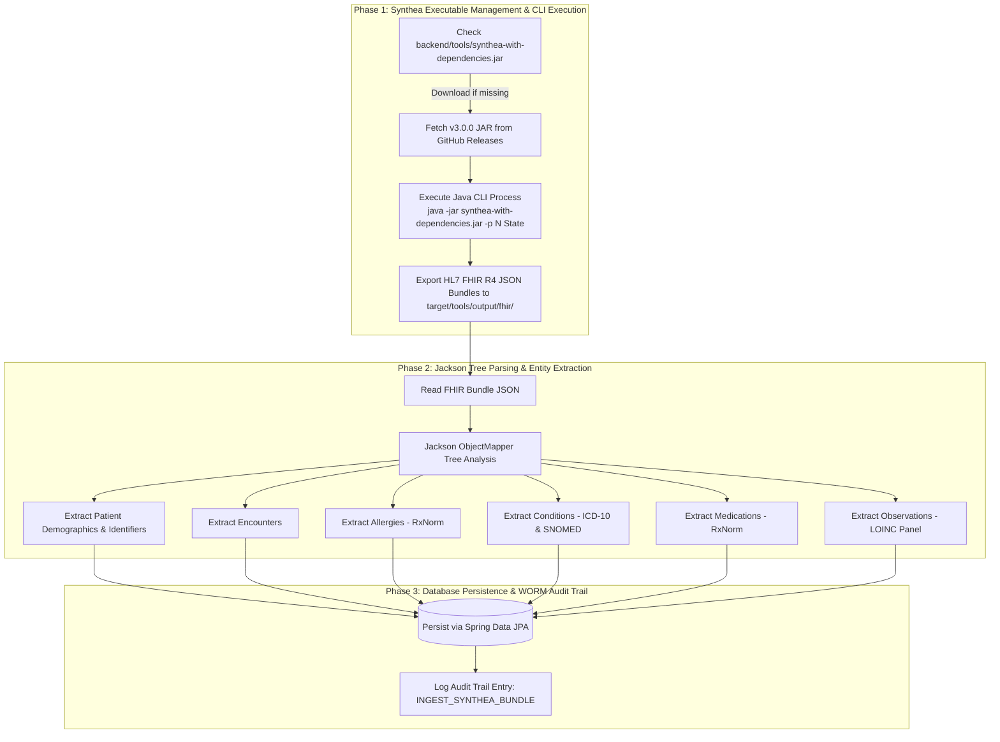

# Synthea Framework Synthetic Patient Pipeline Guide

This document provides complete documentation for the **Synthea Synthetic Patient Generator Pipeline** in MedVault, detailing how the official Synthea framework (`synthea-with-dependencies.jar` v3.0.0) is integrated into MedVault's Spring Boot backend and Angular presentation layer.

---

## 🧬 Overview & Purpose

Synthea™ is an open-source, synthetic patient generator that models the medical history of synthetic patients. It outputs realistic, HL7 FHIR R4-compliant patient records without containing any Real World Data (RWD) or Protected Health Information (PHI).

MedVault integrates the official Synthea Java framework to automatically generate patient cohorts, parse their complete clinical history, and ingest them directly into MedVault's relational database and HIPAA WORM audit log.

---

## 🏗️ Technical Architecture & Pipeline Sequence

The pipeline operates in three distinct phases:



---

## 📊 FHIR R4 Resource to MedVault Entity Mapping Matrix

Synthea generates standard FHIR R4 JSON bundles. MedVault's `SyntheaPipelineService` parses these bundles into internal JPA entities according to the following mapping schema:

| FHIR R4 Resource | Target MedVault Entity | Mapped Attributes & Codings |
| :--- | :--- | :--- |
| **`Patient`** | `Patient` | Full Name (`given` + `family`), MRN (`urn:oid:2.16.840.1.113883.4.1`), SSN (`urn:oid:2.16.840.1.113883.4.1.ssn`), Birth Date (`birthDate`), Gender, Telecom, Address (`line` + `city` + `state`), Blood Type. |
| **`Encounter`** | `Encounter` | Visit Class (`AMB` / `IMP` / `EMER`), Chief Complaint (`reasonCode.text`), Clinical Notes, Start Date (`period.start`), Status (`completed`). |
| **`AllergyIntolerance`** | `Allergy` | Allergen Name (`code.text`), RxNorm Code (`code.coding.code`), Category (`medication` / `environment`), Criticality (`severity`), Reaction Description (`manifestation.text`). |
| **`Condition`** | `Diagnosis` | Condition Name (`code.text`), **ICD-10** Code (`http://hl7.org/fhir/sid/icd-10`), **SNOMED-CT** Code (`http://snomed.info/sct`), Onset Date (`onsetDateTime`), Status (`CHRONIC`). |
| **`MedicationRequest`** | `Prescription` | Medication Name (`medicationCodeableConcept.text`), **RxNorm** Code (`http://www.nlm.nih.gov/research/umls/rxnorm`), Dosage, Route, Frequency, Instructions (`dosageInstruction.text`). |
| **`Observation`** | `Vitals` | Vital Signs Panel mapped via standard **LOINC** codes (see breakdown below). |

### LOINC Vital Signs Mapping Breakdown

MedVault extracts longitudinal vital signs from FHIR `Observation` entries by filtering on standard LOINC codes:

| Vital Measurement | LOINC Code | LOINC Display Term | Default Unit |
| :--- | :--- | :--- | :--- |
| **Systolic Blood Pressure** | `8480-6` | Systolic blood pressure | `mmHg` |
| **Diastolic Blood Pressure** | `8462-4` | Diastolic blood pressure | `mmHg` |
| **Heart Rate** | `8867-4` | Heart rate | `beats/min` |
| **Body Temperature** | `8310-5` | Body temperature | `Cel` (°C) |
| **Oxygen Saturation (SpO2)**| `2708-6` | Oxygen saturation in blood | `%` |
| **Respiratory Rate** | `9279-1` | Respiratory rate | `breaths/min` |
| **Body Weight** | `29463-7` | Body weight | `kg` |
| **Body Height** | `8302-2` | Body height | `cm` |
| **Blood Glucose** | `15074-8` | Glucose in Blood | `mg/dL` |

---

## 💻 CLI Script Execution Guide

Developers and QA engineers can trigger the Synthea generation pipeline directly from the command line using the included automation script:

```bash
# Usage: ./scripts/run_synthea_pipeline.sh [COUNT] [STATE]
./scripts/run_synthea_pipeline.sh 5 Massachusetts
```

### Script Execution Parameters:
- **`COUNT`**: Number of synthetic patient profiles to generate (Default: `3`).
- **`STATE`**: U.S. State demographic target (Default: `"Massachusetts"`). Supported states include `Massachusetts`, `New York`, `California`, `Texas`, `Florida`, `Illinois`.

---

## 🖥️ Admin Command Center Web UI Controls

Hospital administrators (`ROLE_ADMIN`) and physicians (`ROLE_DOCTOR`) can also execute the Synthea pipeline directly from the MedVault Web Application:

1. Navigate to **Admin Command Center** (`/admin`).
2. Locate the **Synthea Synthetic Patient Generator Pipeline** card.
3. Configure **Cohort Population Count** (1 to 50) and select the **Demographic Region (State)**.
4. Click **Generate Synthea Cohort** to execute the pipeline.
5. Alternatively, click **Ingest FHIR Bundle** to paste a raw FHIR JSON bundle for instant parsing and DB ingestion.

---

> **Note:** The Synthea JAR and generated output are not included in the repository. They are automatically downloaded on first run — just execute the CLI script or trigger generation from the Admin UI and everything is handled for you.

