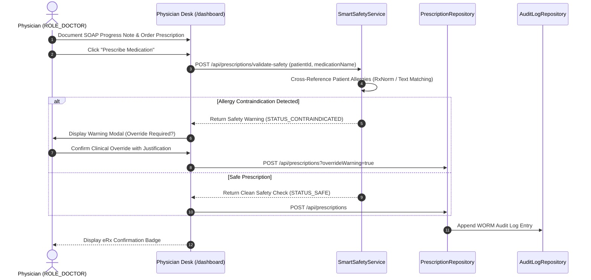
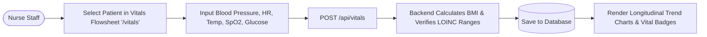
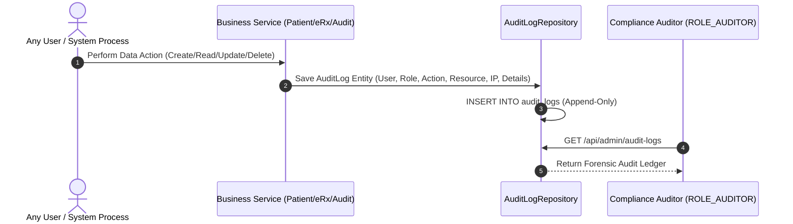
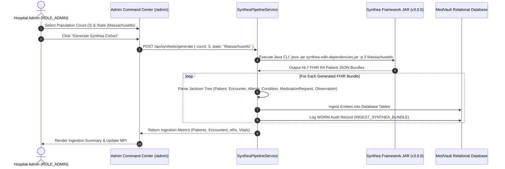
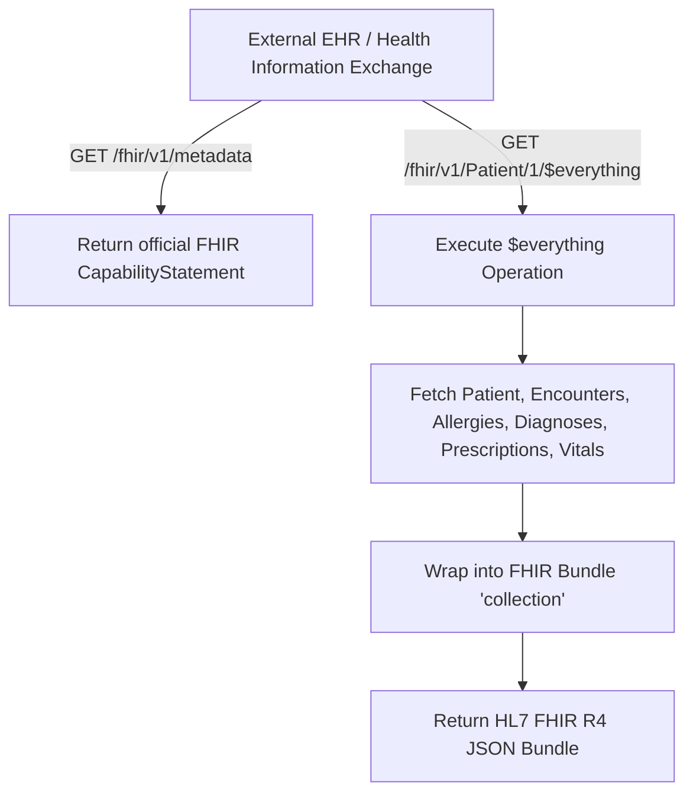

# MedVault Clinical & Administrative Workflows Guide

This document details the primary end-to-end workflows of the **MedVault EHR Platform**, featuring real-world analogies, step-by-step technical procedures, and visual sequence diagrams.

---

## 📋 Table of Workflows

1. [Workflow 1: Master Patient Index (MPI) & Scoped Patient Portal](#1-master-patient-index-mpi--scoped-patient-portal)
2. [Workflow 2: Physician Desk, SOAP Notes & Smart eRx Safety Engine](#2-physician-desk-soap-notes--smart-erx-safety-engine)
3. [Workflow 3: Bedside Nurse Longitudinal Vitals Flowsheet](#3-bedside-nurse-longitudinal-vitals-flowsheet)
4. [Workflow 4: HIPAA § 164.312(b) Immutable WORM Audit Vault](#4-hipaa--164312b-immutable-worm-audit-vault)
5. [Workflow 5: Synthea Framework Synthetic Patient Pipeline](#5-synthea-framework-synthetic-patient-pipeline)
6. [Workflow 6: HL7 FHIR R4 Interoperability Subsystem](#6-hl7-fhir-r4-interoperability-subsystem)

---

## 1. Master Patient Index (MPI) & Scoped Patient Portal

### 💡 Analogy: The Vault Box Key
Imagine a bank safety deposit vault. Hospital administrators have the master key to view all registered account holders in the Master Patient Index (MPI). However, when a patient logs in with their personal key (`user_kamran`), the bank teller strictly guides them to their own safety deposit box (`/api/patients/user/{userId}`), completely preventing them from seeing other customers' boxes.

### 🔄 Workflow Flowchart

```mermaid
flowchart TD
    Start([User Signs In]) --> RoleCheck{Check JWT Role}
    
    RoleCheck -->|ROLE_ADMIN / DOCTOR / NURSE| MPIView[Access Master Patient Index '/patients']
    MPIView --> Search[Search Patients by Name / MRN / SSN]
    MPIView --> Register[Register New Patient Profile]

    RoleCheck -->|ROLE_PATIENT| PortalView[Access Scoped Patient Portal '/patient-portal']
    PortalView --> FetchSelf[GET /api/patients/user/{userId}]
    FetchSelf --> DisplaySelf[Render Personal Health Summary, Conditions, eRx, Vitals]
```

### Technical Sequence
1. Patient logs in at `/login`. Spring Security returns a signed JWT containing claims (`sub: "user_kamran"`, `roles: ["ROLE_PATIENT"]`).
2. Angular `AuthGuard` checks the role and routes the user to `/patient-portal`.
3. The portal makes a request to `GET /api/patients/user/{userId}`.
4. The backend verifies that the requested `userId` matches `SecurityContext.getCurrentUser().getId()`, returning strictly that patient's health summary.

---

## 2. Physician Desk, SOAP Notes & Smart eRx Safety Engine

### 💡 Analogy: The Co-Pilot & Safety Checklist
When a commercial pilot prepares for takeoff, a co-pilot reads off a safety checklist. In MedVault, when a physician documents a SOAP (Subjective, Objective, Assessment, Plan) progress note and prescribes a medication (e.g. Penicillin), the **Smart Safety Engine** acts as the co-pilot. It instantly cross-checks the order against documented RxNorm allergy codes and alerts the physician before the prescription is issued.

### 🔄 Sequence Diagram



### Technical Sequence
1. Physician selects a patient from the Master Patient Index and opens the Physician Desk (`/dashboard`).
2. Physician documents Subjective symptoms, Objective findings, Assessment diagnoses, and Plan treatment.
3. Upon entering a prescription (e.g., `Penicillin G 500mg`), `ApiService.validatePrescriptionSafety` calls `POST /api/prescriptions/validate-safety`.
4. `SmartSafetyService` queries the patient's active allergies. If a match is found (e.g., Penicillin allergy), it flags a warning.
5. If the physician confirms a clinical override, the order is persisted with `overrideWarning=true` and logged in the WORM audit trail.

---

## 3. Bedside Nurse Longitudinal Vitals Flowsheet

### 💡 Analogy: The Intensive Care Telemetry Board
In an ICU or inpatient unit, nurses record periodic vital signs to monitor patient trends over time. MedVault's **Bedside Nurse Flowsheet** allows nurses to enter Blood Pressure, Heart Rate, Temperature, SpO2, Respiratory Rate, Height, Weight, BMI, and Blood Glucose, visualizing trends over time.

### 🔄 Workflow Flowchart



### Technical Sequence
1. Nurse logs in (`nurse_priya`) and accesses Bedside Vitals Flowsheet (`/vitals`).
2. Inputs patient measurements (e.g., BP `120/80`, HR `72`, Temp `36.8°C`, SpO2 `98%`).
3. Backend auto-calculates BMI from height and weight (`kg / m^2`).
4. Telemetry trend charts dynamically update to display longitudinal health trajectory.

---

## 4. HIPAA § 164.312(b) Immutable WORM Audit Vault

### 💡 Analogy: The Flight Data Recorder
Just like an airplane's black box recorder records every altitude change and pilot command without allowing edit or deletion, MedVault's **WORM (Write Once, Read Many) Audit Vault** records every system action. Once an entry is written, no administrator, doctor, or database user can alter or delete it.

### 🔄 Sequence Diagram



### Technical Sequence
1. Any clinical or administrative action triggers `auditLogRepository.save(new AuditLog(...))`.
2. The database executes an append-only `INSERT INTO audit_logs`.
3. Compliance Auditors (`auditor`) access `/audit-ledger` to inspect forensic logs, filter by user, role, or date, and verify HIPAA § 164.312 compliance.

---

## 5. Synthea Framework Synthetic Patient Pipeline

### 💡 Analogy: The Medical Holodeck
When clinical software requires testing with thousands of realistic patient records, human test data creates privacy risks. Synthea acts as a "Medical Holodeck", generating realistic synthetic patient lifetimes from birth to current age, complete with realistic disease trajectories, hospital visits, allergies, medications, and vitals.

### 🔄 Sequence Diagram



---

## 6. HL7 FHIR R4 Interoperability Subsystem

### 💡 Analogy: The Universal Translator
When transferring a patient between two different hospital systems, health data must be formatted in a universal standard. MedVault's **HL7 FHIR R4 Engine** serves as a Universal Translator, allowing external systems to query standard FHIR resources (`/fhir/v1/Patient`, `/fhir/v1/Observation`) or export a complete clinical record using the `$everything` bundle operation.

### 🔄 Workflow Flowchart


